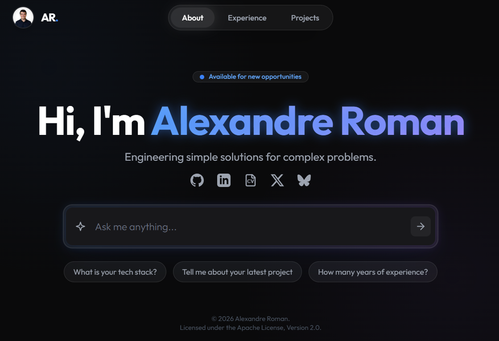
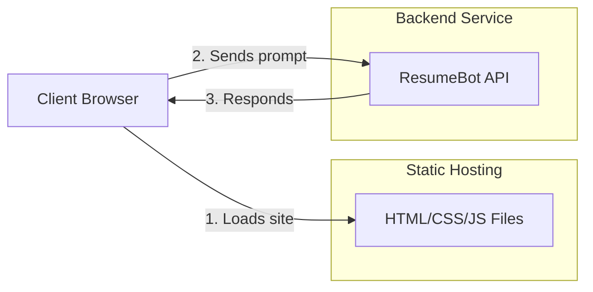

# Alexandre Roman - Personal Landing Page



This repository contains the source code for my personal landing page, built with [Hugo](https://gohugo.io/).
The site integrates an interactive chat interface ([Resume Bot](https://github.com/alexandreroman/resumebot)) allowing users to ask questions about my professional background.

## Architecture

The project relies on a JAMstack architecture:
- **Frontend**: Static site generated by Hugo, hosted via GitHub Pages.
- **Backend**: An external API (`resumebot.rpilab.dev`) handles the chat conversational logic.



## Technologies

- **Hugo**: Static site generator.
- **TailwindCSS**: CSS framework for design.
- **JavaScript (Vanilla)**: Client-side interactivity management (chat).

## Installation and Development

To run the project locally:

1. Ensure you have [Hugo](https://gohugo.io/installation/) installed (extended version recommended for Tailwind).
2. Clone the repository.
3. Start the development server:

```bash
make dev
```

The site will be accessible at `http://127.0.0.1.nip.io:1313/`.
